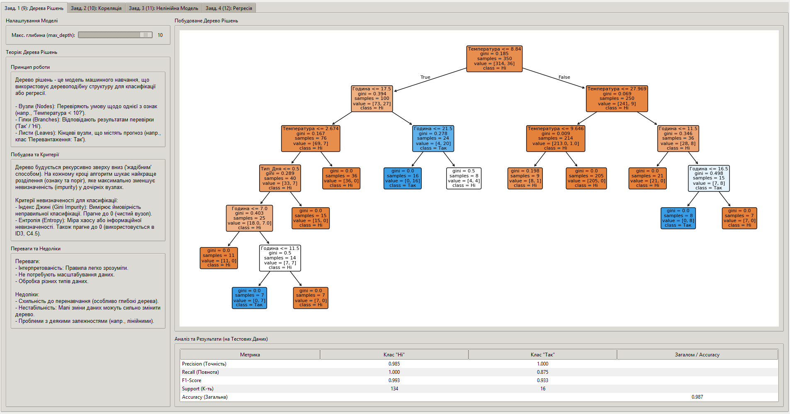
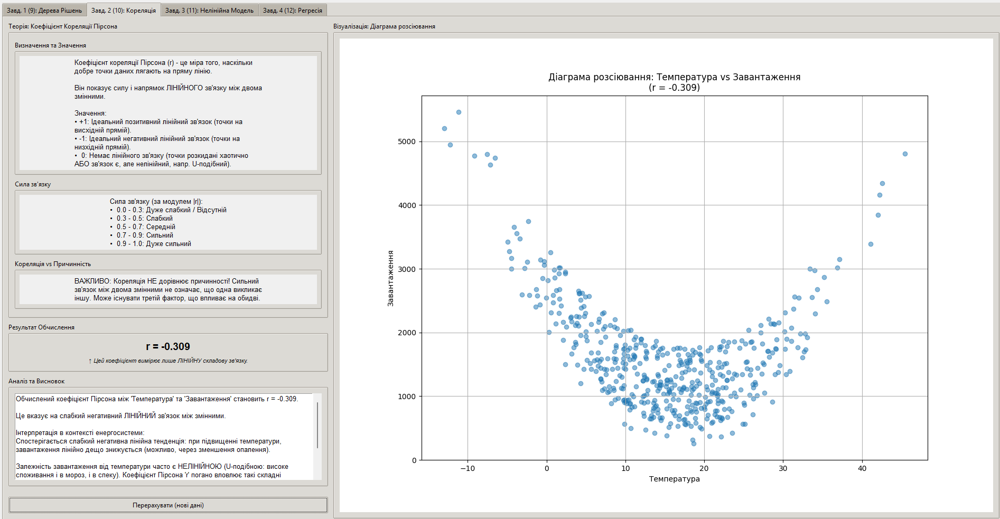
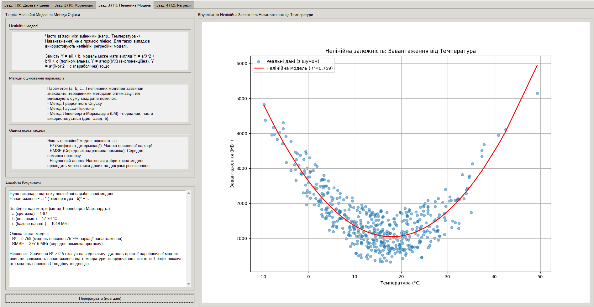
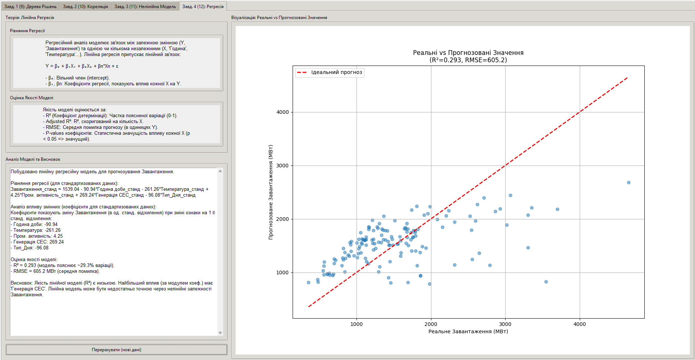

# Дашборд (Рівень 3): Поглиблений аналіз даних для моніторингу енергосистеми 📊

Цей проєкт є другим дашбордом, розробленим в рамках модульної роботи з курсу "Інтелектуальний аналіз даних". Він містить реалізації 4 завдань третього рівня складності, адаптованих до теми **"Система моніторингу завантаженості енергосистеми"**.

**Репозиторій проєкту:** [Lutvunenko-Dmutro/Dashboard_Level3](https://github.com/Lutvunenko-Dmutro/intellectual-data-analysis-tasks-energy/tree/main/Dashboard_Level3) 
## 🎯 Мета

Продемонструвати застосування більш складних методів аналізу даних, таких як дерева рішень, кореляційний та регресійний аналіз, для вирішення задач класифікації та моделювання залежностей в енергетичній системі.

## ✨ Демонстровані завдання (Вкладки дашборду)

1.  **Завдання 1 (Вкладка 9): Дерева Рішень:**
    * Побудова, візуалізація та аналіз дерева рішень для **класифікації стану енергосистеми** (напр., наявність перевантаження) на основі таких факторів, як година доби, температура та тип дня. Демонструється інтерпретація правил дерева та оцінка його точності.
  
1.  **Завдання 2 (Вкладка 10): Кореляційний Аналіз:**
    * Обчислення та аналіз **коефіцієнта кореляції Пірсона** між `Температурою` та `Завантаженням системи`. Включає інтерпретацію сили та напрямку лінійного зв'язку, візуалізацію за допомогою діаграми розсіювання та пояснення обмежень кореляції (нелінійні зв'язки, причинність).
  
1.  **Завдання 3 (Вкладка 11): Нелінійна Модель:**
    * Аналіз **нелінійної форми зв'язку** між `Температурою` та `Завантаженням` за допомогою параболічної моделі. Демонструється підгонка параметрів моделі з використанням **методу Левенберга-Марквардта** (`scipy.optimize.curve_fit`) та оцінка якості отриманої моделі (R², RMSE, візуальний аналіз).
  
1.  **Завдання 4 (Вкладка 12): Регресійний Аналіз:**
    * Побудова **лінійної регресійної моделі** для прогнозування `Завантаження системи` на основі кількох незалежних змінних (`Година доби`, `Температура`, `Тип_Дня` та ін.). Виведення **рівняння регресії**, аналіз **впливу змінних** (коефіцієнтів) та **оцінка загальної якості** моделі (R², RMSE).
  

## 🛠️ Використані технології

* **Мова:** Python 3.x
* **GUI:** Tkinter (`tkinter`, `ttk`)
* **Візуалізація:** Matplotlib
* **Обчислення та МН:** NumPy, Pandas, Scikit-learn (Дерева рішень, Лінійна регресія, метрики), SciPy (Нелінійна апроксимація)

## 🚀 Як запустити

1.  **Клонуйте репозиторій:**
    ```bash
    git clone https://github.com/Lutvunenko-Dmutro/intellectual-data-analysis-tasks-energy.git
    ```
2.  **Переконайтесь, що залежності встановлено** (ті ж самі, що й для першого дашборду, окрім `scikit-fuzzy`, якщо він не потрібен тут):
    ```bash
    pip install numpy pandas matplotlib scikit-learn scipy
    ```
    *(Примітка: Можливо, знадобиться також файл `tab1_feature_selection.py` з першого дашборду у цій же папці для коректної роботи імпорту `create_energy_dataset`, або скопіюйте цю функцію в кожен файл)(Рішення перетащіть фали в основну папку)*
3.  **Запустіть головний файл:**
    ```bash
    python main_dashboard_level3.py
    ```

## 📝 Примітки

* Кожна вкладка реалізована в окремому файлі (`tabX_....py`). Повний код доступний у репозиторії.
* Симуляції використовують випадкові дані, тому результати (коефіцієнти, R², вигляд дерева) можуть дещо відрізнятися при кожному запуску.
