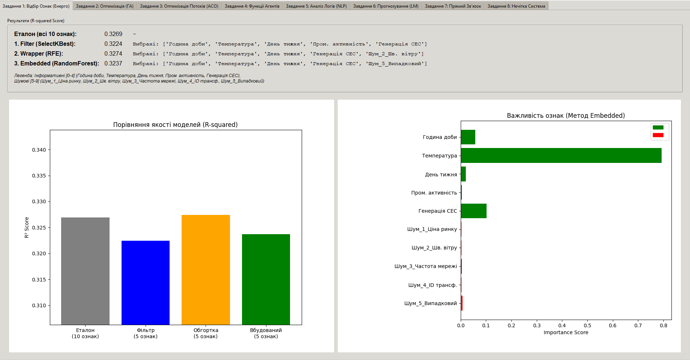
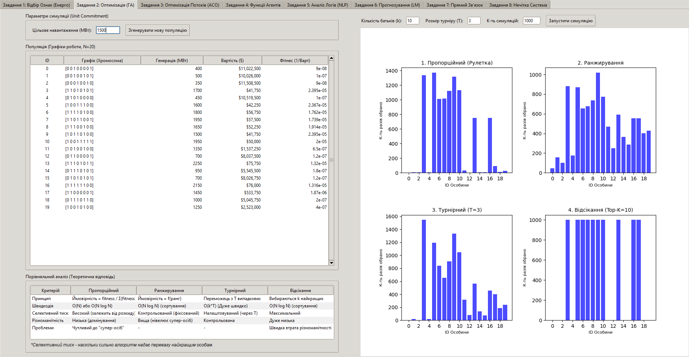
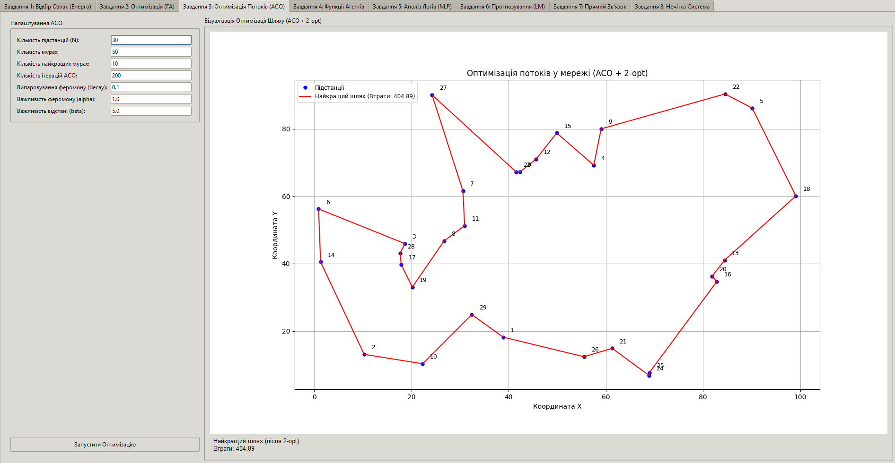
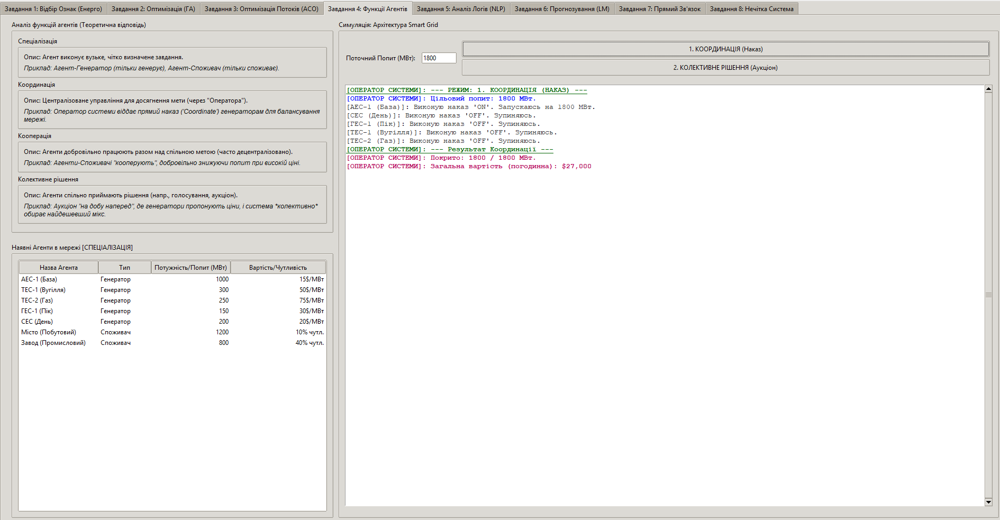
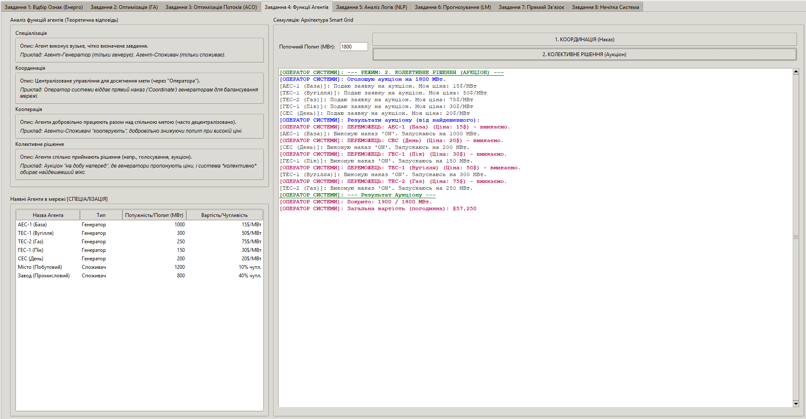
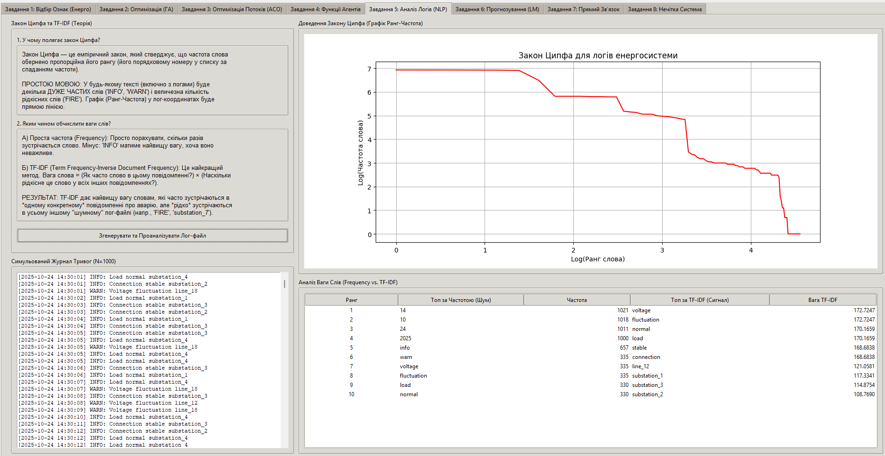
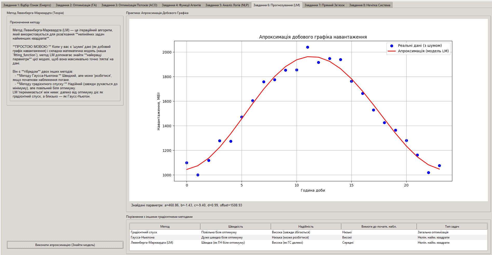
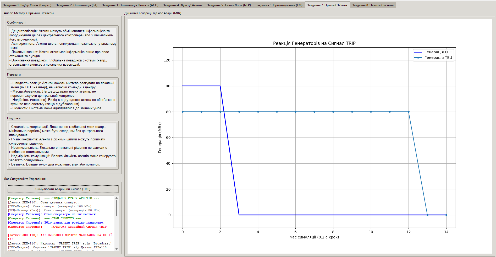
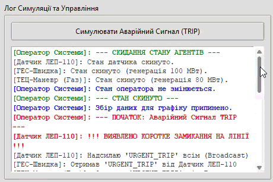
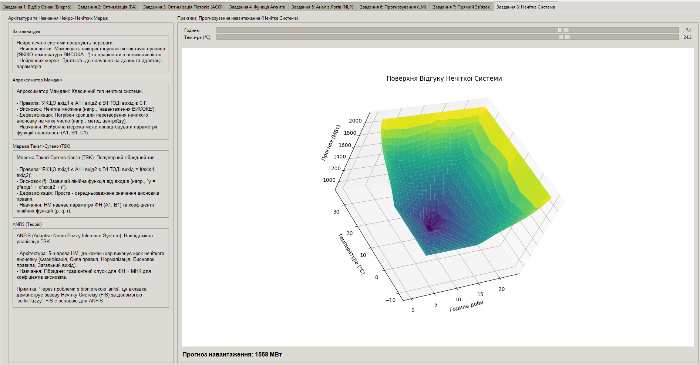

# Дашборд: Аналіз методів інтелектуального аналізу даних на прикладі моніторингу енергосистеми ⚡️

Цей проєкт реалізує інтерактивний дашборд на Python (Tkinter), який демонструє виконання 8 завдань з курсу "Інтелектуальний аналіз даних", адаптованих до теми **"Система моніторингу завантаженості енергосистеми"**.

## 🎯 Мета

Візуалізувати та порівняти різні методи інтелектуального аналізу даних, застосовуючи їх до практичних задач моніторингу та оптимізації енергосистеми.

## ✨ Демонстровані завдання (Вкладки дашборду)

Тут ви можете розмістити скріншоти кожної вкладки:

1.  **Відбір інформативних ознак:** Порівняння методів Filter, Wrapper, Embedded для виявлення факторів, що впливають на завантаження мережі.

2.  **Оператори відбору (ГА):** Симуляція генетичного алгоритму для оптимізації графіка роботи генераторів.

1.  **Метод мурашиних колоній (ACO):** Оптимізація потоків потужності в мережі (+ 2-opt).
  
1.  **Функції агентів:** Симуляція архітектури Smart Grid та взаємодії агентів.


1.  **Закон Ципфа та TF-IDF:** Аналіз симульованих журналів тривог.

1.  **Метод Левенберга-Марквардта:** Нелінійне прогнозування добового графіка навантаження.

1.  **Мультиагентний метод (Прямий зв'язок):** Симуляція децентралізованої реакції агентів на аварійні події.


1.  **Нейро-нечіткі мережі:** Демонстрація базової системи нечіткого висновку (FIS) за допомогою `scikit-fuzzy`.


## 🛠️ Використані технології

* **Мова:** Python 3.x
* **GUI:** Tkinter (бібліотека `tkinter`, `ttk`)
* **Візуалізація:** Matplotlib
* **Обчислення та МН:** NumPy, Pandas (для даних в Завд.1), Scikit-learn (відбір ознак, TF-IDF), SciPy (Левенберг-Марквард), Scikit-fuzzy (нечітка логіка)
* **(ANFIS):** *Спроба інтеграції бібліотеки `anfis` (не вдалася через проблеми сумісності/імпорту).*

## 🚀 Як запустити

1.  **Клонуйте репозиторій:**
    ```bash
    git clone https://github.com/Lutvunenko-Dmutro/intellectual-data-analysis-tasks-energy.git
    ```
2.  **Встановіть залежності:** (Найкраще створити віртуальне середовище)
    ```bash
    pip install numpy pandas matplotlib scikit-learn scipy scikit-fuzzy
    # pip install anfis # Можна спробувати, але в поточній версії не працює
    ```
3.  **Запустіть головний файл:**
    ```bash
    python main_dashboard.py
    ```

## 📝 Примітки

* Кожна вкладка дашборду реалізована в окремому файлі (`tabX_....py`).
* Через проблеми з бібліотекою `anfis`, Завдання 8 реалізовано за допомогою `scikit-fuzzy` для демонстрації нечіткої системи (FIS).
* Симуляції використовують випадкові дані, тому результати можуть трохи відрізнятися при кожному запуску.

